<div align="center">

# ✨ Hand-Controlled Particle Magic

Transform **40,000 particles** between 3D shapes and sacred geometry patterns using just your hand gestures. Pure WebGL wizardry powered by React and MediaPipe.

[](https://react.dev/)
[](https://threejs.org/)
[](https://developers.google.com/mediapipe)

  

</div>

---

## 🎭 Two Modes, Infinite Magic

<table>
<tr>
<td width="50%">

### 🦋 Butterfly Mode
**Open your hand** to see a 3D sphere made of:
- Icosahedron wireframe
- Three intersecting rings
- Spiral patterns
- Floating particles

</td>
<td width="50%">

### 🔮 Magic Circle Mode
**Pinch your fingers** to reveal 6 layers of sacred geometry:
- Hexagonal cores (Metatron's Cube)
- Flower of Life patterns
- Rotating stars & spirographs
- Mathematical spirals
- Seven orbiting spheres with trails

</td>
</tr>
</table>

---

## 🎮 Controls

<div align="center">

| 🖐️ Gesture | 🎯 Action |
|:---:|:---|
| 🤏 **Pinch** | Transform between modes |
| ✋ **Move** | Drag particles anywhere |
| 🔄 **Rotate** | Spin everything |
| ✊ **Fist** | Explode particles |
| 👆 **Fingertips** | Shoot numbers |

</div>

---

## 🚀 Quick Start

```bash
# Install
npm install

# Run (opens at localhost:3000)
npm run dev
```

**That's it!** Allow camera access and start waving your hand. 

> ⚠️ **Needs:** Webcam • Chrome/Edge • Good lighting

---

## 🎨 What Makes It Special

```mermaid
graph LR
    A[Your Hand] -->|MediaPipe| B[21 Landmarks]
    B -->|Calculate| C[Pinch • Position • Rotation]
    C -->|GPU Shaders| D[40K Particles]
    D -->|60 FPS| E[✨ Magic ✨]
```



### Under the Hood
- **40,000 particles** animated entirely on GPU
- **No React re-renders** during tracking (uses `useRef`)
- **Smooth morphing** between 3D sphere ↔ 2D mandala
- **Additive blending** for glow effects
- **Real-time hand tracking** at 30fps → rendered at 60fps

---

## 🛠️ Tech Stack

<div align="center">

**Frontend** • React 19 • TypeScript 5.8 • Vite 6.2

**3D Graphics** • Three.js • React Three Fiber • Drei

**Computer Vision** • MediaPipe Hand Tracking

</div>

---

## 📁 Project Structure

```
├── components/
│   ├── ButterflyCurve.tsx       # 40K particle system + shaders
│   ├── HandController.tsx       # MediaPipe hand tracking  
│   ├── NumberProjectiles.tsx    # Fingertip number spawner
│   └── Scene.tsx                # 3D canvas setup
├── App.tsx                      # Main component
└── types.ts                     # TypeScript definitions
```

---

## ⚙️ Configuration

**Adjust particle colors** in `App.tsx`:
```typescript
color: '#8b5cf6'  // Change to any hex color
scale: 3.5        // Make bigger/smaller
```

**Camera resolution** in `HandController.tsx`:
```typescript
video: { width: 320, height: 240 }  // Lower = faster
```

---

## 🐛 Troubleshooting

<details>
<summary><strong>Camera not working?</strong></summary>

- Use **HTTPS** or **localhost** only
- Click the lock icon → allow camera
- Try Chrome or Edge
- Close Zoom/Teams/other camera apps

</details>

<details>
<summary><strong>Laggy performance?</strong></summary>

- Improve lighting (very important!)
- Lower camera resolution to 160x120
- Close other browser tabs
- Enable hardware acceleration in browser settings

</details>

<details>
<summary><strong>Hand not detected?</strong></summary>

- Show full hand in frame
- Stand arm's length from camera
- Avoid shadows and backlighting
- Plain background works best

</details>

---

## 🚢 Deploy

```bash
npm run build        # Creates dist/ folder
npm run preview      # Test production build
```

Deploy to: **Vercel** • **Netlify** • **GitHub Pages**

> Must use HTTPS (camera API requirement)

---

## 📝 License

MIT - Do whatever you want with it!

---

## 💫 Credits

Built with [Three.js](https://threejs.org/) • [React Three Fiber](https://docs.pmnd.rs/react-three-fiber) • [MediaPipe](https://developers.google.com/mediapipe) • Sacred Geometry

---

<div align="center">

### ⭐ Star if you like it!

**Made with React, Three.js & Mathematical Beauty**

[🔗 Documentation](https://docs.pmnd.rs/react-three-fiber) • [🐛 Report Bug](https://github.com/yourname/repo/issues) • [💡 Request Feature](https://github.com/yourname/repo/issues)

</div>
